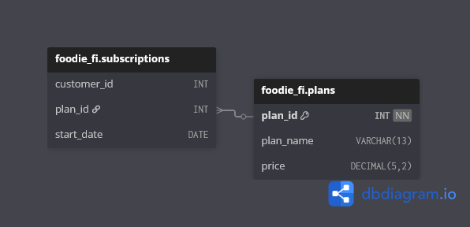

# 🥑 Case Study #3: Foodie-Fi

> 🔗 **Check out the original challenge prompt and dataset here:** [Case Study #3: Foodie-Fi](https://8weeksqlchallenge.com/case-study-3/)

## 📋 Table of Contents
- [The Business Problem](#-the-business-problem)
- [Tech Stack & Skills Applied](#%EF%B8%8F-tech-stack--skills-applied)
- [Entity Relationship Diagram](#%EF%B8%8F-entity-relationship-diagram)
- [Highlight Queries & Engineering Logic](#-highlight-queries--engineering-logic)
- [What I Would Do Differently in Production](#%EF%B8%8F-what-i-would-do-differently-in-production)

---

## 🏢 The Business Problem

Danny launched **Foodie-Fi** — a Netflix-style subscription streaming platform for food and cooking content. Every business decision is intended to be data-driven, and the dataset reflects a realistic SaaS subscription model with trials, plan upgrades, downgrades, and churn events.

**The Goal:**
Analyze subscription behavior across 1,000 customers to surface conversion rates, churn patterns, and revenue trends. The centerpiece challenge was **Section C** — constructing a fully materialized `payments` table from scratch by generating recurring monthly billing rows that don't exist in the source data, handling plan changes, prorated upgrade charges, and billing cutoffs entirely in T-SQL.

---

## 🛠️ Tech Stack & Skills Applied

- **Database Engine:** SQL Server (T-SQL)
- **Data Engineering Skills Applied:**
  - **Recursive CTEs:** Generating recurring date rows via anchor + recursive member pattern
  - **Window Functions:** `LAG`, `LEAD`, `RANK`, `ROW_NUMBER` for subscription timeline logic
  - **Payment Table Construction:** `SELECT INTO` to materialize a derived billing table
  - **Subscription Analytics:** Churn detection, conversion rate calculation, point-in-time snapshots
  - **NULL Handling:** Explicit `IS NULL` guards to prevent silent recursion termination
  - **Bucketing Logic:** Integer division for 30-day period distribution analysis

---

## 🗄️ Entity Relationship Diagram



---

## 💡 Highlight Queries & Engineering Logic

### Highlight 1 — Recursive CTE: Generating a Payments Table from Scratch
**Question:** *Section C — Create a new `payments` table for the year 2020 that includes the amount paid by each customer in the `subscriptions` table, with one row per monthly payment. The table should include: `customer_id`, `plan_id`, `plan_name`, `payment_date`, `amount`, and `payment_order`.*
*Full script: [03_C_Challenge_Payment.sql](03_C_Challenge_Payment.sql)*

**The Problem:** The `subscriptions` table stores only plan *change events* — not individual payments. A customer on basic monthly from January to April has one row, not four. To build a proper billing table, recurring payment rows needed to be generated from nothing, stopping at either a plan change or the end of 2020. Additionally, customers who upgrade from basic to a pro plan mid-cycle should only be charged the price difference — not the full pro amount.

**The Solution:** A recursive CTE generates monthly payment rows by advancing `start_date` one month per iteration. `LEAD()` is computed only in the anchor member — window functions are not permitted in the recursive member — and is carried forward as a plain column through the recursion to serve as the stopping condition. Two termination conditions cover both scenarios: customers who changed plans (stop when the next payment would overlap the next plan start date) and customers who stayed on the same plan (stop at end of 2020). A second CTE applies `LAG()` to detect basic-to-pro upgrades and deduct the already-paid basic monthly amount from the pro charge on the upgrade date.

<details>
<summary><b>Click to expand full query</b></summary>

```sql
-- 1. ANCHOR CTE: Retrieve initial active plans in 2020.
-- Using LEAD() to peek at the next plan's details to calculate exact cutoff dates.
-- Note: Trials (plan_id = 0) are excluded as they are not billed. Churns (plan_id = 4)
-- are temporarily kept to cap the billing cycle in the recursive step.
WITH main_data AS (
    SELECT
        s.customer_id,
        s.plan_id,
        p.plan_name,
        s.start_date,
        p.price,
        LEAD(p.plan_name) OVER (
            PARTITION BY customer_id
            ORDER BY s.start_date) AS next_plan_name,
        LEAD(start_date) OVER (
            PARTITION BY customer_id
            ORDER BY s.start_date) AS next_plan_date,
        LEAD(p.price) OVER (
            PARTITION BY customer_id
            ORDER BY s.start_date) AS next_plan_price
    FROM foodie_fi.subscriptions AS s
    INNER JOIN foodie_fi.plans AS p
        ON s.plan_id = p.plan_id
    WHERE s.plan_id <> 0
      AND s.start_date < '20210101'

    UNION ALL

-- 2. RECURSIVE CTE: Generate monthly payment dates.
    SELECT
        customer_id,
        plan_id,
        plan_name,
        CASE
            WHEN plan_id = 4 THEN start_date
            WHEN start_date < ISNULL(next_plan_date, '20210101') THEN DATEADD(MONTH, 1, start_date)
            END,
        price,
        next_plan_name,
        next_plan_date,
        next_plan_price
    FROM main_data

    -- Recursive termination conditions:
-- a) Stop generating payments once we hit 2021.
-- b) Stop generating payments once the next month's date overlaps with the start of a new plan.
-- c) Exclude Churns (4) and Annuals (3) from looping to prevent infinite billing.
    WHERE start_date < '20210101'
      AND DATEADD(MONTH, 1, start_date) <= ISNULL(next_plan_date, '20210101')
      AND plan_id NOT IN (4, 3)
),

-- 3. PRICING LOGIC: Use LAG() to identify the previous plan's price.
-- This is required to calculate the $9.90 deduction when a
-- customer upgrades from Basic Monthly to a Pro plan.
    basic_to_pro_price AS (
        SELECT
            customer_id,
            plan_id,
            plan_name,
            start_date,
            price,
            next_plan_name,
            next_plan_date,
            next_plan_price,
            LAG(plan_id) OVER (
                PARTITION BY customer_id
                ORDER BY start_date) last_plan,
            LAG(price) OVER (
                PARTITION BY customer_id
                ORDER BY start_date) last_price
        FROM main_data
-- Final Cleanup: Remove churn rows from the actual payment output.
-- The start_date <> next_plan_date filters out duplicate rows that occur when
-- a customer upgrades from Pro Monthly to Annual — both plans share the same start date,
-- causing the monthly row to appear alongside the annual.
        WHERE plan_id <> 4
          AND (next_plan_date IS NULL OR start_date <> next_plan_date)
    )

-- 4. FINAL OUTPUT: Apply the upgrade deductions and sequence the payments.
SELECT
    customer_id,
    plan_id,
    plan_name,
    start_date,
    CASE
        WHEN plan_id IN (2, 3) AND last_plan = 1 THEN price - last_price
        ELSE price
        END AS amount_paid,
    RANK() OVER (
        PARTITION BY customer_id
        ORDER BY start_date) AS payment_order
INTO foodie_fi.payments
FROM basic_to_pro_price;
```
</details>

#### 📊 Result Set *(sample)*
| customer\_id | plan\_id | plan\_name | start\_date | amount\_paid | payment\_order |
| :--- | :--- | :--- | :--- | :--- | :--- |
| 1 | 1 | basic monthly | 2020-08-08 | 9.90 | 1 |
| 1 | 1 | basic monthly | 2020-09-08 | 9.90 | 2 |
| 1 | 1 | basic monthly | 2020-10-08 | 9.90 | 3 |
| 1 | 1 | basic monthly | 2020-11-08 | 9.90 | 4 |
| 1 | 1 | basic monthly | 2020-12-08 | 9.90 | 5 |
| 16 | 1 | basic monthly | 2020-06-07 | 9.90 | 1 |
| 16 | 1 | basic monthly | 2020-07-07 | 9.90 | 2 |
| 16 | 1 | basic monthly | 2020-08-07 | 9.90 | 3 |
| 16 | 1 | basic monthly | 2020-09-07 | 9.90 | 4 |
| 16 | 1 | basic monthly | 2020-10-07 | 9.90 | 5 |
| 16 | 3 | pro annual | 2020-10-21 | 189.10 | 6 |


---

### Highlight 2 — LAG-Based Immediate Churn Detection
**Question:** *Section B, Q05 — How many customers have churned straight after their initial free trial — what percentage is this rounded to the nearest whole number?*
*Full script: [02_B_Data_Analysis.sql](02_B_Data_Analysis.sql)*

**The Problem:** Identifying customers who went directly from trial (`plan_id = 0`) to churn (`plan_id = 4`) with no paid plan in between cannot be solved with a simple filter — it requires inspecting the *sequence* of plans per customer. Filtering for churn rows alone would also catch customers who churned after months of paid subscription.

**The Solution:** `LAG()` partitioned by `customer_id` brings the previous `plan_id` onto each churn row. Filtering for `plan_id = 4 AND lag_id = 0` precisely isolates the trial-to-churn sequence. The percentage is calculated by cross-joining a scalar `COUNT(DISTINCT customer_id)` derived table — avoiding a third CTE while keeping the logic readable.

```sql
WITH cte AS (
    SELECT
        customer_id,
        plan_id,
        start_date,
        LAG(plan_id) OVER (
            PARTITION BY customer_id
            ORDER BY start_date) AS lag_id
    FROM foodie_fi.subscriptions
),
    churn_count AS (
        SELECT
            SUM(CASE
                    WHEN plan_id = 4 AND lag_id = 0
                        THEN 1
                    ELSE 0 END) AS immediate_churn

        FROM cte
    )
SELECT
    immediate_churn,
    CAST((100.0 * (immediate_churn) / uni_cus) AS DECIMAL(5, 0)) AS immediate_churn_percentage

FROM churn_count
CROSS JOIN (
    SELECT
        COUNT(DISTINCT customer_id) AS uni_cus
    FROM foodie_fi.subscriptions
) AS cust_unique;
```
#### 📊 Result Set
| immediate\_churn | immediate\_churn\_percentage |
| :--- | :--- |
| 92 | 9 |

---

### Highlight 3 — Point-in-Time Snapshot with Descending Window Rank
**Question:** *Section B, Q07 — What is the customer count and percentage breakdown of all 5 `plan_name` values at `2020-12-31`?*
*Full script: [02_B_Data_Analysis.sql](02_B_Data_Analysis.sql)*

**The Problem:** "Current plan as of a date" is a point-in-time snapshot query — not a simple filter. A customer who changed plans three times in 2020 has three rows, but only the most recent one on or before `2020-12-31` represents their active plan. Filtering by date alone would return all historical rows, not the current state.

**The Solution:** `ROW_NUMBER()` with `ORDER BY start_date DESC, plan_id DESC` assigns rank 1 to each customer's most recent plan on or before the snapshot date. The secondary sort on `plan_id DESC` makes tie-breaking deterministic when two plan changes share the same date. Filtering `WHERE rn = 1` then isolates one current-state row per customer before aggregating.

```sql
-- Filter the date and assign a rank 1 to the last plan
WITH current_plan_rank AS (
    SELECT
        customer_id,
        plan_id,
        start_date,
        ROW_NUMBER() OVER (
            PARTITION BY customer_id
            ORDER BY start_date DESC, plan_id
            ) AS cust_plan_ranking
    FROM foodie_fi.subscriptions
    WHERE start_date < '20210101'
),
-- Filter to the current plan, aggregates a count column to divide later
    filtering AS (
        SELECT
            customer_id,
            plan_name,
            COUNT(*) OVER ( ) AS all_plans_counts

        FROM current_plan_rank AS cur
        INNER JOIN foodie_fi.plans AS p
            ON p.plan_id = cur.plan_id
        WHERE cust_plan_ranking = 1

    )
SELECT
    plan_name,
    COUNT(plan_name) AS current_plan_count,
    CAST((100.0 * COUNT(plan_name)) / MAX(all_plans_counts) AS DECIMAL(5, 1)) AS current_plan_percent
FROM filtering
GROUP BY
    plan_name;
```
#### 📊 Result Set
| plan\_name | current\_plan\_count | current\_plan\_percent |
| :--- | :--- | :--- |
| pro annual | 195 | 19.5 |
| pro monthly | 326 | 32.6 |
| churn | 236 | 23.6 |
| basic monthly | 224 | 22.4 |
| trial | 19 | 1.9 |


---

## ⚙️ What I Would Do Differently in Production

- The `payments` table was materialized with `SELECT INTO` for simplicity — in production it would be a pre-defined table refreshed by a scheduled stored procedure or ETL job triggered on new subscription events
- In a real billing system, payment rows would be written to the database at the moment each charge occurs — not derived retroactively from subscription events. The recursive CTE approach works for analysis but would not replace an actual billing pipeline.
- `LEAD()` on the raw subscriptions table assumes clean, ordered data — a production pipeline would validate for duplicate events or out-of-order timestamps before running billing logic on top

---

[👉 Click here to view the complete SQL scripts for all 4 sections](.)